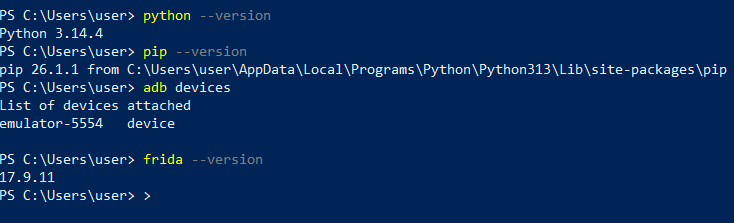
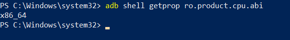
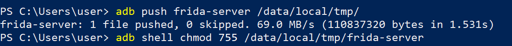
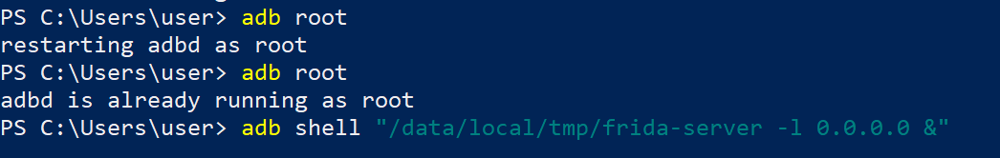
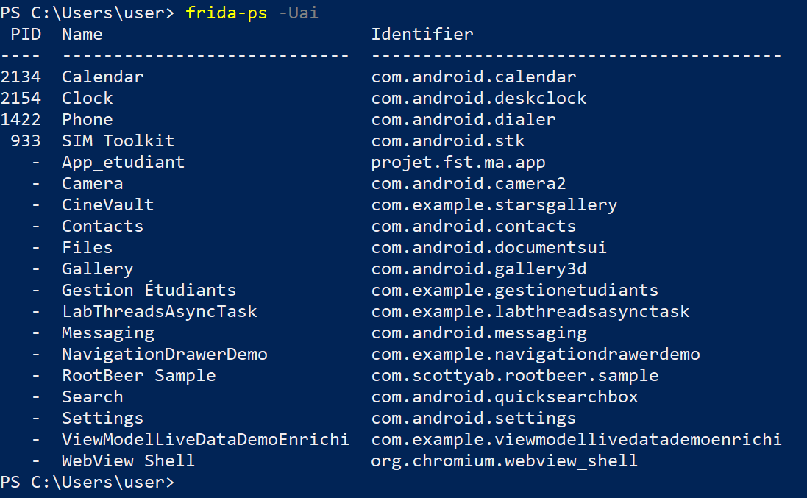
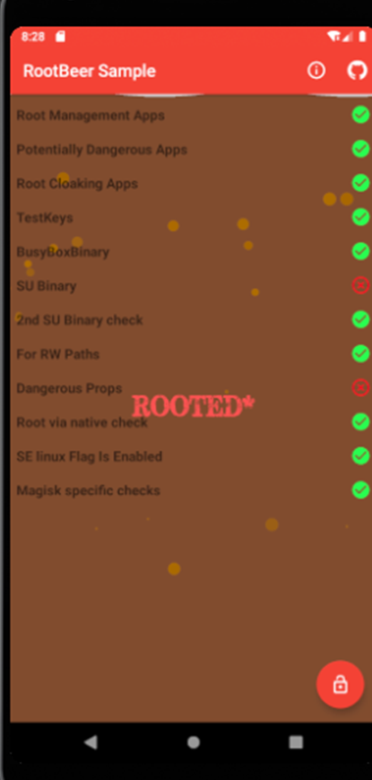
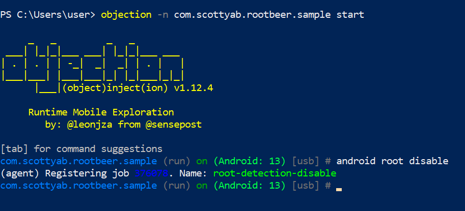
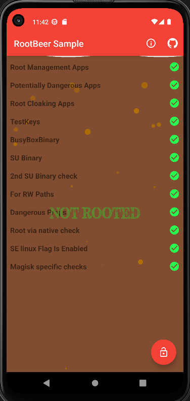

# LAB14 - Bypass Root Detection sur Android avec Frida, Objection et Hooks Natifs

## Objectif

Ce lab documente les techniques dynamiques utilisees pour contourner la detection root dans une application Android. Le travail repose sur Frida, Objection et des hooks Java/natifs executes au runtime.

L'objectif est de montrer :

1. La preparation de l'environnement Android/Frida.
2. Le lancement de `frida-server` sur l'appareil ou l'emulateur.
3. L'injection d'un script Frida simple.
4. Le contournement de controles root Java.
5. Le contournement de controles root natifs.
6. L'utilisation d'Objection pour automatiser le bypass.

## Avertissement legal

Ces techniques doivent etre utilisees uniquement dans un cadre autorise : lab, cours, audit, recherche ou application que vous possedez. Elles ne doivent pas etre appliquees a des applications ou appareils tiers sans autorisation explicite.

## Arborescence du depot

```text
.
├── README.md
├── .gitignore
├── assets/
│   └── screenshots/
│       └── .gitkeep
├── docs/
│   └── checklist.md
└── scripts/
    ├── hello.js
    ├── bypass_root_basic.js
    └── bypass_native.js
```

## Environnement cible

Les commandes ci-dessous sont adaptees a PowerShell sur Windows.

| Element | Valeur attendue |
| --- | --- |
| OS hote | Windows |
| Terminal | PowerShell |
| Outils Android | ADB / Platform Tools |
| Instrumentation | Frida + frida-tools |
| Automatisation | Objection |
| App cible | A renseigner selon le lab |
| Package cible | `<package>` |

Quand les captures seront ajoutees, les placer dans :

```text
assets/screenshots/
```

Nommage conseille :

```text
01-python-pip-frida-version.png
02-adb-devices.png
03-device-architecture.png
04-frida-server-push.png
05-frida-server-running.png
06-frida-ps-apps.png
07-hello-js-injection.png
08-root-detection-before.png
09-java-bypass-script.png
10-native-bypass-script.png
11-objection-root-disable.png
12-root-detection-after.png
```

## 1. Preparation de l'environnement

Verification de Python et pip :

```powershell
python --version
pip --version
```

Installation ou mise a jour de Frida :

```powershell
python -m pip install --upgrade frida frida-tools
```

Verification de Frida :

```powershell
frida --version
python -c "import frida; print(frida.__version__)"
```


## 2. Verification ADB

Verification de la connexion Android :

```powershell
adb version
adb devices
```

Resultat attendu :

```text
List of devices attached
<device_id>    device
```



## 3. Identification de l'architecture CPU

La version de `frida-server` doit correspondre a l'architecture de l'appareil Android.

```powershell
adb shell getprop ro.product.cpu.abi
```

Exemples possibles :

- `arm64-v8a`
- `armeabi-v7a`
- `x86_64`



## 4. Installation et lancement de frida-server

Apres avoir telecharge la version de `frida-server` correspondant a `frida --version` et a l'architecture Android :

```powershell
adb push frida-server /data/local/tmp/
adb shell chmod 755 /data/local/tmp/frida-server
```

Lancement de `frida-server` :

```powershell
adb shell "/data/local/tmp/frida-server -l 0.0.0.0"
```

Ou en arriere-plan :

```powershell
adb shell "nohup /data/local/tmp/frida-server -l 0.0.0.0 >/dev/null 2>&1 &"
```

Redirection des ports Frida si necessaire :

```powershell
adb forward tcp:27042 tcp:27042
adb forward tcp:27043 tcp:27043
```





## 5. Validation de Frida

Lister les applications et processus visibles par Frida :

```powershell
frida-ps -Uai
```

Le package de l'application cible doit apparaitre dans la liste.



## 6. Injection Frida simple

Le script [scripts/hello.js](scripts/hello.js) sert a verifier que l'injection fonctionne.

Execution :

```powershell
frida -U -f <package> -l scripts/hello.js --no-pause
```

Resultat attendu :

```text
[+] Script injecte: Java.perform OK
```

Capture a ajouter : `assets/screenshots/07-hello-js-injection.png`

## 7. Etat initial : detection root active

Avant d'appliquer le bypass, lancer l'application normalement et observer les controles root.



Observation a documenter :

- L'application detecte le root.
- Les checks suspects peuvent inclure `su`, `busybox`, `test-keys`, RootBeer ou des chemins systeme.

## 8. Bypass Java avec Frida

Le script [scripts/bypass_root_basic.js](scripts/bypass_root_basic.js) neutralise plusieurs controles Java courants :

- `android.os.Build.TAGS`
- `java.io.File.exists()`
- `java.lang.Runtime.exec()`
- `com.scottyab.rootbeer.RootBeer.isRooted()` si la librairie est presente

Execution :

```powershell
frida -U -f <package> -l scripts/bypass_root_basic.js --no-pause
```

Resultat attendu :

```text
[+] Build.TAGS -> release-keys
[+] Runtime.exec hooks installed
[+] Java root bypass installed
```

Capture a ajouter : `assets/screenshots/09-java-bypass-script.png`

## 9. Bypass natif avec Frida

Certaines applications detectent le root via du code C/C++ et des appels libc comme `open`, `openat`, `access`, `stat` ou `lstat`.

Le script [scripts/bypass_native.js](scripts/bypass_native.js) bloque l'acces a certains chemins suspects.

Execution combinee Java + natif :

```powershell
frida -U -f <package> -l scripts/bypass_root_basic.js -l scripts/bypass_native.js --no-pause
```

Capture a ajouter : `assets/screenshots/10-native-bypass-script.png`

Pour investiguer les appels natifs :

```powershell
frida-trace -U -i open -i access -i stat -i openat -i fopen -i readlink <package>
```

## 10. Bypass avec Objection

Installation d'Objection :

```powershell
python -m pip install --upgrade objection
```

Attachement a l'application cible :

```powershell
objection -g <package> explore
```

Puis dans le shell Objection :

```text
android root disable
```

Alternative au lancement :

```powershell
objection -g <package> explore --startup-command "android root disable"
```



## 11. Validation finale

Apres injection des hooks ou utilisation d'Objection, relancer ou rafraichir l'application puis verifier que la detection root n'est plus active.



Resultat attendu :

- L'application ne detecte plus le root.
- Les logs Frida/Objection montrent les hooks appliques.
- Le comportement est modifie au runtime sans patcher l'APK.

## 12. Depannage

### Frida introuvable

```powershell
python -m pip install --upgrade frida frida-tools
```

Verifier aussi que le dossier `Scripts` de Python est dans le `PATH`.

### Impossible de se connecter a frida-server

```powershell
adb devices
adb shell ps | findstr frida
adb forward tcp:27042 tcp:27042
adb forward tcp:27043 tcp:27043
```

Verifier que la version de `frida-server` correspond a la version du client Frida.

### L'application crash au spawn

Essayer l'attachement sur une application deja lancee :

```powershell
frida -U -n "<NomDuProcessus>" -l scripts/hello.js
```

Puis ajouter les hooks un par un.

### Classes obfusquees

Lister les classes chargees contenant `root` :

```javascript
Java.perform(function () {
  Java.enumerateLoadedClasses({
    onMatch: function (name) {
      if (name.toLowerCase().includes('root')) console.log(name);
    },
    onComplete: function () {
      console.log('done');
    }
  });
});
```

## Conclusion

Ce lab montre que la detection root peut etre contournee dynamiquement avec Frida et Objection. Les hooks Java permettent de neutraliser les checks classiques, tandis que les hooks natifs permettent de couvrir les verifications effectuees via libc.

La preuve finale doit contenir les captures avant/apres et les logs montrant l'installation des hooks.
